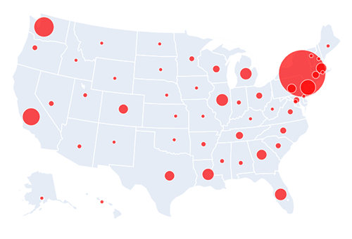

# Covid mapping
A jupyter notebook used for mapping the coronavirus outbreak using pandas and plotly.

There are already great visualization tools online: this is mainly to hook into the raw online data in case anyone is curious about how to work the knobs, and maybe  do some modeling.

The Johns Hopkins University Center for Systems Science and Engineering  generously makes their data available, and they have made the best visualization tool out there, at:
https://www.arcgis.com/apps/opsdashboard/index.html#/bda7594740fd40299423467b48e9ecf6

# Future possibilities
- Plot curves for all states instead of aggregate over entire country.
- Normalize to population density instead of showing raw number (e.g., comparing california to rhode island is ridiculous).
- Fit exponential to data (and see how much it depends on state's population density).
- Extract deaths/recovered data in addition to number of diagnoses.
- Come up with way to determine if a curve has hit the bend (i.e., has an exponential started to drop to linear yet?).

## On papermill
Eventually I want this to automatically update, and can use papermill:
https://towardsdatascience.com/introduction-to-papermill-2c61f66bea30

## Acknowledgments
Thanks to repo contributer Julia (https://github.com/juliakm) for building the jekyll site and helping to troubleshoot everything.
